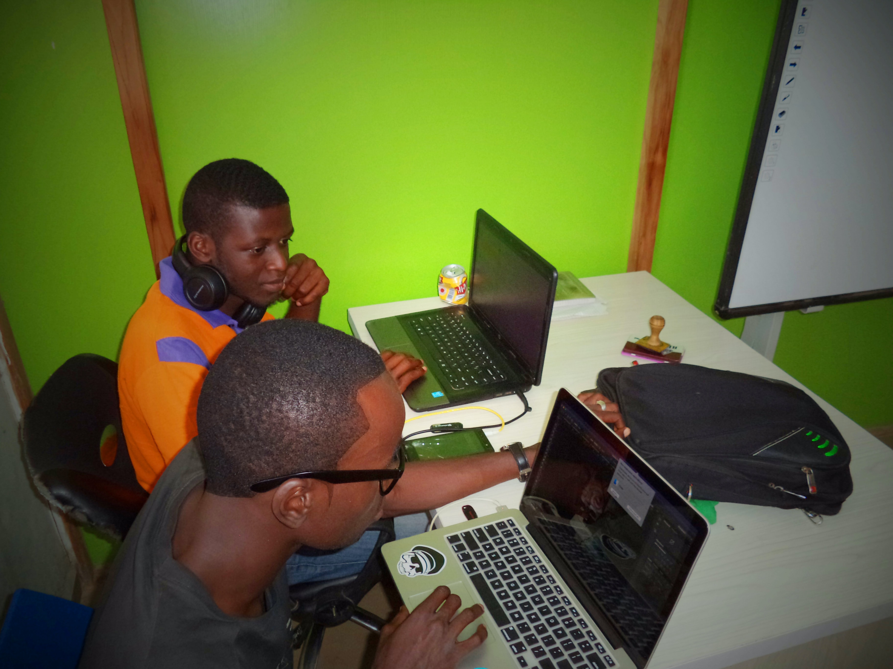

# Software Developer

---

## clichés

---

## clichés

---

## clichés

---

## clichés

---

## Former Skills

- over time:
  - operating a computer == programming
  - necessary for operating a computer
  - important for operating a computer
  - hardly important for operating a computer

---

## Modern Skills

- communication
- passion & understanding for technology
- resilience & stubbornness vs. flexibility & learning
- flexibility

---

## Summary

- Modern software is communication between people, that is machine readable.

---

## Myths 1

- IT == Programmer

---

## Myths 2

- The introverted

---

## Myths 3

- The rockstar programmer
- [Try it for yourself](https://hackertyper.net)

---

## Daily Business

- Communicate
- Learn
- Develop
- Code

---

## Communicate

- Emails
- Chat
- Voice
- Meetings

---
## Learn

- DIY Projects
- Meetups
- Courses

---
## Code

- Code != Develop
- RTFM
- "Code Monkey"

---

## Develop

- Design
- Architecture
- etc.

---

## Quotes 1

Man gewinnt keine Preise für Komplexität, jede Zeile Code, auch in Abhängigkeiten ist eine Quelle von Problemen.
Code ist dazu da von Menschen gelesen zu werden, der Compiler kommt schon klar.
Man gewinnt keine Preise dafür jedes Sprachfeature einzusetzen, weniger ist mehr.

---

## Quotes 2

"Bad programmers write bad code in any language" (und umgekehrt). Diese ideologische Diskussion, welche Sprache/Technologie man "heutzutage benutzten MUSS", ist fast immer Bullshit. Nutze, womit DU gut für Dein Problem zurecht kommst & bleibe offen für neues.

---

## Quotes 3

Fangt klein an, testet viel und erweitert dann.

---
## Quotes 4

"30min selbst versuchen, dann jemanden fragen"

---
## Quotes 5

Senior Entwickler machen auch gerne Fehler. Man sollte sich ruhig trauen, Dinge anzusprechen, die einem komisch vorkommen.

---

## Podcast 1

(CRE 90: Java)[https://cre.fm/cre090-java]
(CRE 146: Javscript)[https://cre.fm/cre146-javascript]
